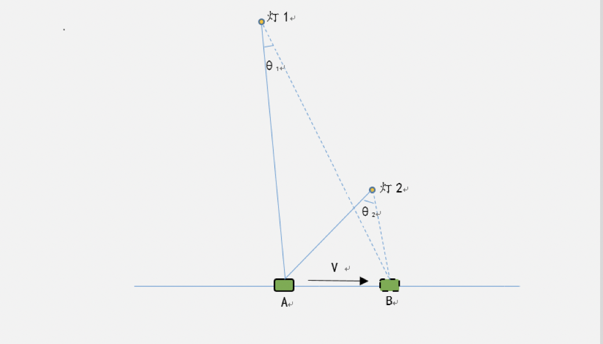
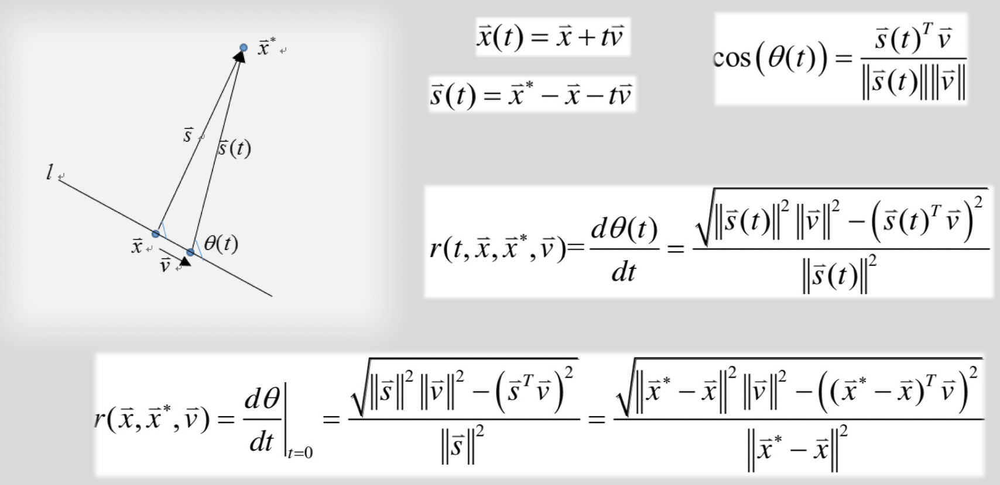
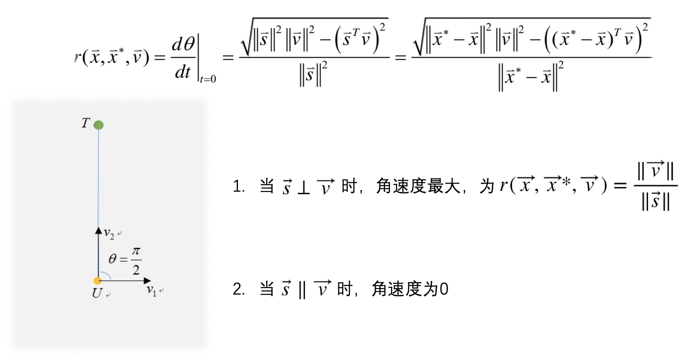
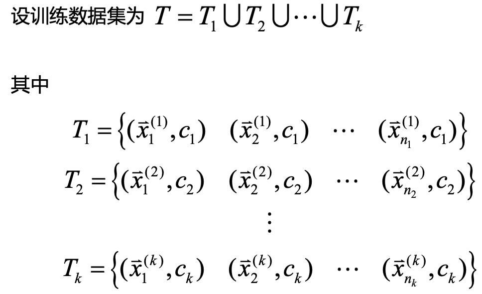
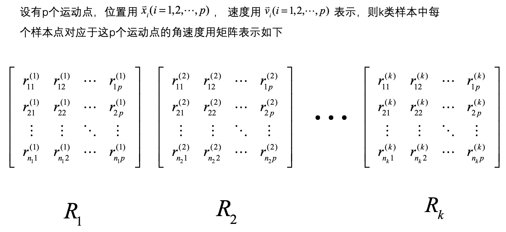
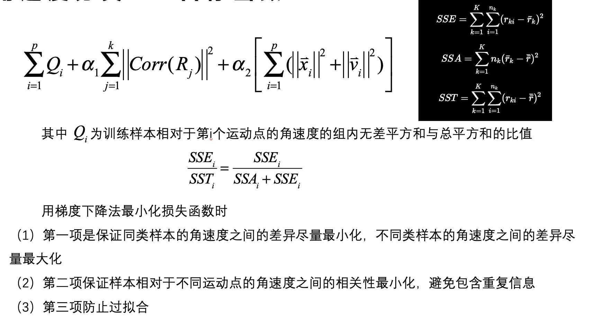
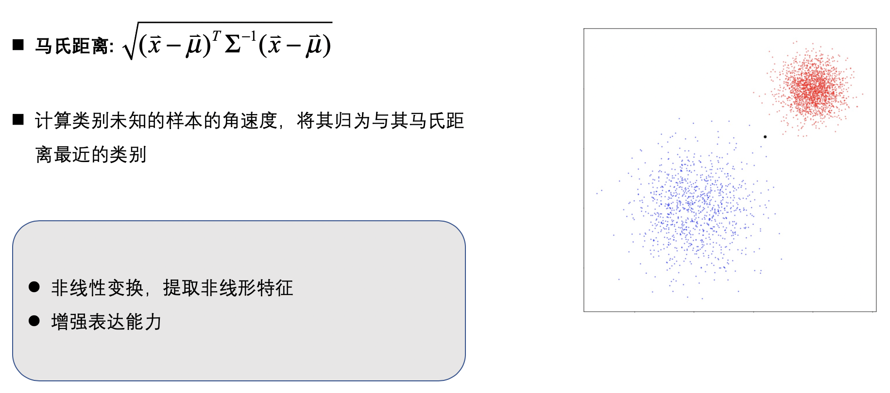

## **问题引入**
在实际问题中，研究多指标的问题是经常遇到的问题。由于变量个数太多，在高维空间中研究样本的分布规律比较复杂。  
我们自然想用较少的综合变量来代替原来较多的变量，而且这几个综合变量对样本类别的判别能力都较强

***
## **模型思想介绍**
角速度判别分析的基本思想是做角速度变换。对于$k$组$m$元数据，在$m$维空间中找$p(p<m)$个运动点，将$m$维空间中的每个样本数据做角速度变换为$p$维空间中的样本点，并且组与组之间尽可能地分开，而衡量组与组之间是否分开的方法是借助于方差分析的思想  

***
## **情景引入**

+ 绿色物体由A位置以速度$\vec{v}$运动到B位置过程中，相对于“灯1”转过的角度$\theta_1$比灯2的$\theta_2$，所以物体相对于“灯1”的转速大于相对于“灯2”的

***
## **角速度公式推导**

***
## **角速度性质探索**
+ 1.物体"速度$\vec{v}$的方向"对先转速度的影响

+ 2."运动物体到参考点的位置"对先转速度的影响

***
## **利用角速度进行分类**
### **样本介绍**
+ 总共有$k$类

### **样本转化为角速度**
+ $p$个运动点将原始样本维度降为$p$维

### **目标函数**

### **分类**
